# NotePad
项目来自于官方早期的数据库操作的基本教程。
更多的解析参考[Android Sample--NotePad解析](https://blog.csdn.net/llfjfz/article/details/67638499)

一、项目简介

本项目基于 Android 官方早期示例 NotePad 改造完成，是一个运行在 Android 平台上的本地记事本应用。
在保留原始示例使用 ContentProvider + SQLite 数据库 管理笔记的基础上，对功能和界面做了如下扩展：

为笔记记录 创建时间 / 修改时间，并在列表中显示最近修改时间；
支持在列表中 关键字搜索笔记；
为笔记新增 分类字段，支持按分类筛选与修改分类；
对列表项和编辑界面做了适当的 UI 调整，界面更简洁清晰，统一采用蓝白色系美化。

---

二、功能特性

1. 基础记事功能

新建笔记：通过列表页右上角“新建”菜单创建空白笔记；
编辑笔记：点击列表中的某条记录进入编辑界面，可修改标题和正文；
删除笔记：点击列表中某条记录后，可点击删除；
复制笔记：支持从上下文菜单中复制一条笔记的内容。

相关核心类：

NotePad.Notes：定义数据库表名与字段常量；
NotePadProvider：继承 ContentProvider，负责对 SQLite 的增删改查；
NotesList：主列表界面，展示所有笔记；
NoteEditor：编辑单条笔记的界面；
TitleEditor：单独修改标题的弹窗界面。

---

2. 时间戳（创建时间 / 修改时间）

数据库在原有示例的基础上新增并使用了两个时间字段：

COLUMN_NAME_CREATE_DATE：笔记创建时间；
COLUMN_NAME_MODIFICATION_DATE：笔记最后修改时间。

在 NotePadProvider 中：
创建表结构时为这两个字段分配 INTEGER 类型；
插入与更新时，会使用 System.currentTimeMillis() 自动写入 / 更新时间戳；

在 NotesList 中：
PROJECTION 中包含 COLUMN_NAME_MODIFICATION_DATE；
在 SimpleCursorAdapter.ViewBinder 里，将该字段格式化为 yyyy-MM-dd HH:mm 形式显示在列表第二行。

效果：
列表每一条笔记显示两行信息：
1. 第一行：标题（后面会追加分类信息）；
2. 第二行：最近修改时间，便于用户查看更新记录。

---

3. 搜索功能

在笔记列表界面中集成了 SearchView 搜索框：

在 res/menu/list_options_menu.xml 中为 menu_search 配置了 actionViewClass="android.widget.SearchView"；
在 NotesList.onCreateOptionsMenu() 中拿到 SearchView 并设置：
setQueryHint(getString(R.string.menu_search)) 设置提示文本；
setOnQueryTextListener 监听输入变化和提交事件；

每次输入发生变化时，会调用自定义方法 applyFilters(mCurrentCategoryFilter, query)：
使用 LIKE ? 条件在 title 和 note 字段上进行模糊匹配；
搜索条件可以和分类过滤叠加（见下一节）。

使用方式：
点击工具栏上的放大镜图标，输入关键字即可实时过滤列表；
支持对标题和正文内容进行模糊查询；
搜索框收起时会清空搜索条件，还原为仅按分类或全部显示。

---

4. 分类功能

为每条笔记新增了一个 分类字段：COLUMN_NAME_CATEGORY，并在数据库建表时一起创建。

4.1 分类枚举

在 res/values/strings.xml 中定义了若干分类常量及数组：

单个分类字符串：
category_work：工作
category_study：学习
category_life：生活
category_other：其他

分类选择列表：

string-array name="note_categories"：用于为单条笔记设置分类；
string-array name="note_categories_filter"：在筛选时多了一个「全部」选项。

4.2 设置分类

在 res/menu/list_context_menu.xml 中为长按菜单新增：

<item
android:id="@+id/context_set_category"
android:title="@string/menu_set_category" />

在 NotesList 中：
处理 context_set_category 时调用 showCategoryDialog(noteUri)；
在列表中长按某一条笔记，会弹出一个分类列表对话框，让用户从“工作 / 学习 / 生活 / 其他”中选一个进行分类；
选中后通过 ContentValues 更新当前记录的 COLUMN_NAME_CATEGORY 字段；
更新成功后重新查询列表刷新 UI。

在列表展示时，会在标题前自动加上类似 [工作] 等分类的前缀，方便快速识别。

4.3 按分类筛选

在 res/menu/list_options_menu.xml 中添加“按分类查看”菜单项 menu_filter_category。
在 NotesList 中：
点击“按分类查看”后弹出分类筛选对话框（包含「全部 + 各个分类」）；
选择「全部」时，调用 applyCategoryFilter(null)，不加筛选条件，显示所有笔记；
选择具体分类时，拼接 COLUMN_NAME_CATEGORY = ? 条件进行查询；
分类筛选同样会影响搜索结果，两者通过 applyFilters(category, query) 统一组合。

---

5. 界面与 UI 调整

在原始示例较为朴素的基础上，对 UI 做了一些改动，进一步美化为 蓝 / 白主题 的空间：
列表项布局 res/layout/noteslist_item.xml：
使用两行 TextView 分别显示标题和时间戳；
调整了字体大小与间距，列表信息更清晰易读；
编辑界面布局 res/layout/note_editor.xml：
标题使用较大字号，单行显示；
正文使用 NoteEditor.LinedEditText 自定义控件，模拟有横线的记事本效果；
调整了内容区域的 padding 和字号，使编辑体验更接近真实笔记本。

---

6. 待办（To-Do）功能 

在原有笔记基础上，为每条记录扩展了是否为待办事项（is_todo） 与 是否已完成（is_done） 两个字段。
本功能支持：

将任意笔记标记为待办
标记为已完成 / 取消完成
在列表中通过图标与样式区分待办状态
使用顶部菜单进行筛选：全部 / 仅待办 / 仅已完成

---

6.1 数据库字段

在 NotePad.Notes 中新增两个整型字段：

COLUMN_NAME_IS_TODO   // 是否为待办事项（0=否，1=是）
COLUMN_NAME_IS_DONE   // 是否已完成（0=未完成，1=完成）

NotePadProvider 的建表语句中加入：

is_todo INTEGER DEFAULT 0,
is_done INTEGER DEFAULT 0

升级数据库版本后，系统将在首次安装 APP 时创建带新字段的表结构。

---

6.2 列表界面效果

在 NotesList 中通过 ViewBinder 对待办状态进行视觉渲染：

未完成的待办：在标题前添加 • 点标（如 “• 购物清单”）
已完成的待办：在标题前显示 ✓ 并为标题文本添加删除线
分类仍会显示在最前，如 [学习] ✓ 明天要提交实验报告
这样的组合前缀能让用户在不打开笔记的情况下快速识别任务状态。

---

6.3 设置 / 取消待办

长按某条笔记会打开上下文菜单，其中新增：
设为待办事项 / 取消待办
标记为已完成 / 标记为未完成

点击后系统会更新对应字段，并自动刷新列表。

---

6.4 待办筛选（顶部菜单）

在右上角菜单中新增三个筛选项：

全部笔记
仅看待办
仅看已完成

筛选功能与 搜索、分类过滤 完全兼容：
例如，可以在“学习分类”中，只查看“已完成的待办”。
所有筛选逻辑最终统一在 applyFilters() 中组合处理。

---

6.5 交互体验总结

得益于数据库字段与 UI 联动：
用户可随时将普通笔记转成临时代办
不必额外创建专门的 To-Do 记录
保留了 NotePad 简洁轻量的风格，同时拓展出任务管理能力

---

三、运行环境与构建方式

开发工具：Android Studio
Gradle 版本为Gradle 8.13.0 使用项目中自带的 Gradle Wrapper，直接导入即可
Android 配置（见 app/build.gradle）：
compileSdkVersion 23
minSdkVersion 11
targetSdkVersion 23

运行步骤：

1. 使用 Android Studio 打开项目根目录 Note/；
2. 等待 Gradle 同步完成；
3. 连接模拟器或真机（Android 3.0+ 即可）；
4. 点击 Run，选择设备即可安装并运行。

---

五、使用说明

1. 新建笔记

在列表界面点击右上角“新建”按钮；
输入标题和正文，点击菜单中的“保存”即可。
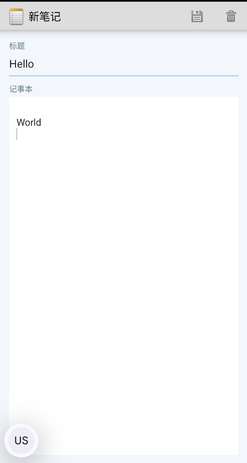

2. 编辑 / 删除笔记

直接点击列表项进入编辑界面进行修改或删除；
长按列表项，在弹出的菜单中选择“删除”可删除该笔记。
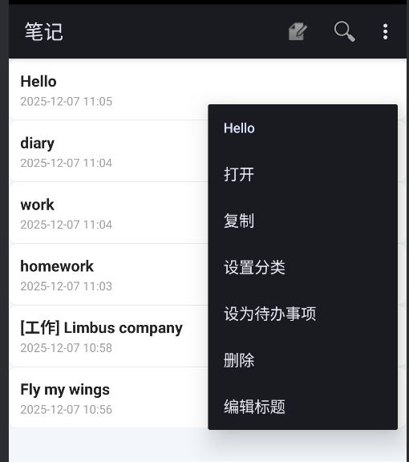

3. 分类管理

长按列表项，选择“设置分类”，在弹窗中选择「工作 / 学习 / 生活 / 其他」；
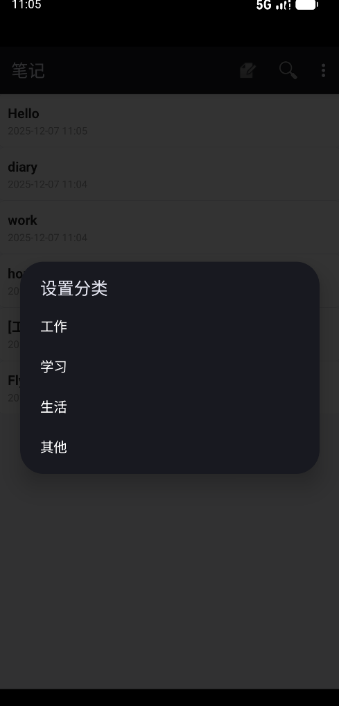
列表标题前会显示类似 [工作] 等分类的前缀；
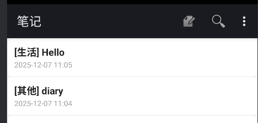
在右上角菜单中选择“按分类查看”，可以切换到只看某一类或全部。
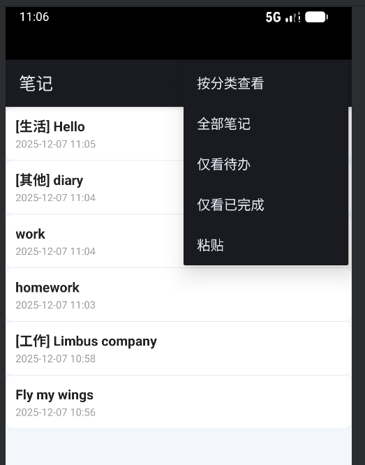
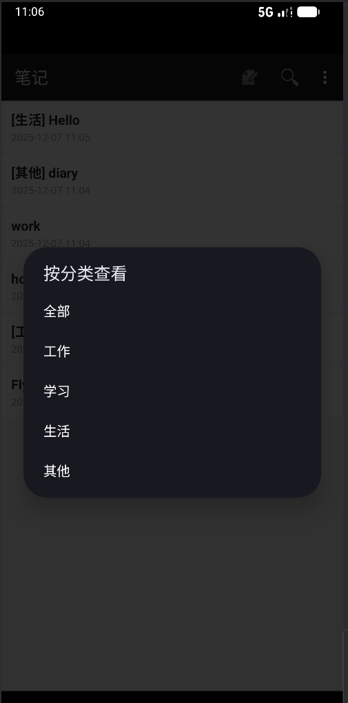
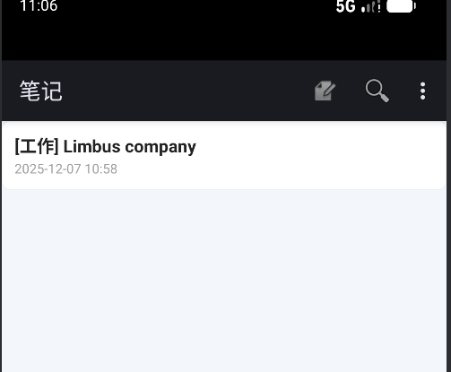

4. 搜索笔记

点击右上角放大镜图标，输入关键字；

列表会实时过滤，支持对标题和正文内容的模糊查询；
搜索条件可以与分类过滤同时生效。

5. 待办功能

设为待办:
   长按列表中的某条笔记 → 选择“设为待办事项”。
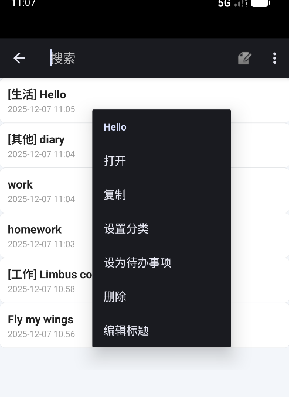

标记完成 / 未完成:
   再次长按该笔记可切换完成状态。
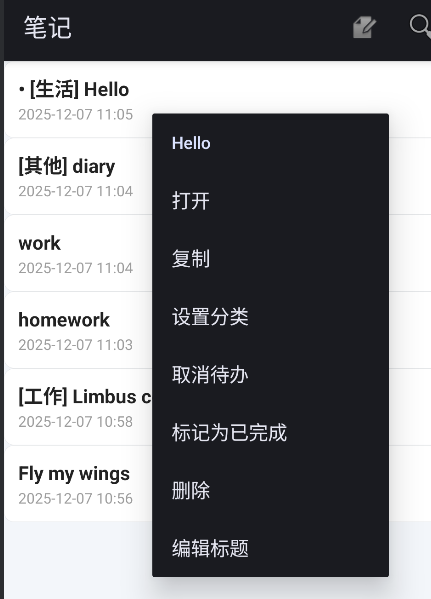
查看待办列表:
   点击右上角菜单：
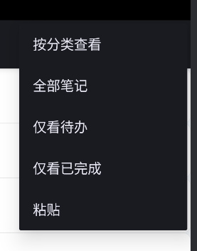
选择“仅看待办”可过滤出所有待办事项；
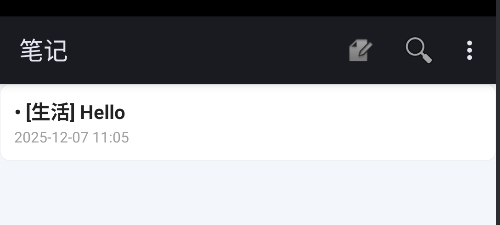
选择“仅看已完成”查看已完成的任务；

选择“全部笔记”恢复默认列表。
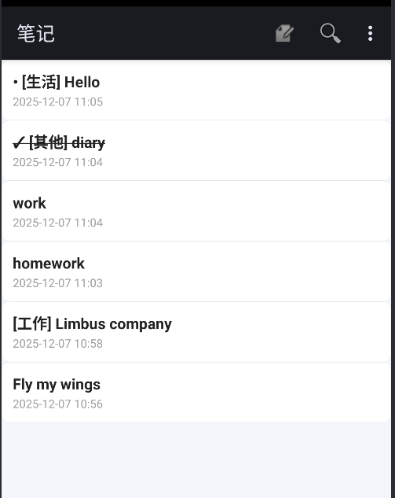
   视觉提示:
• 表示未完成
✓ 表示已完成
已完成任务标题会自动加删除线